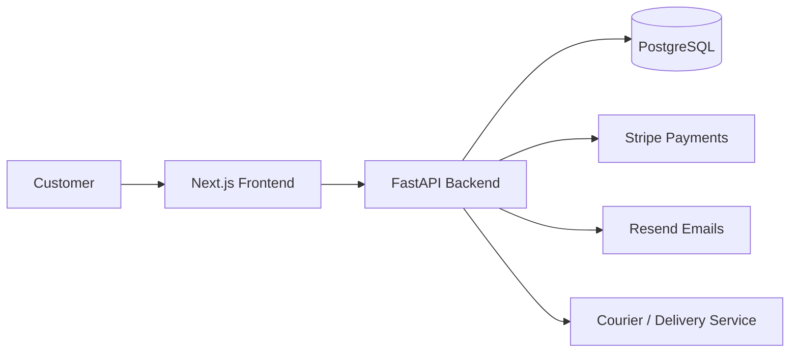

# UK Sweets Architecture Guide

## 1. Overview

UK Sweets is designed as a modern full-stack web application with a clear separation between presentation, business logic, data access, and infrastructure concerns. The system will support a customer-facing storefront, an administrative experience, and a backend API that can evolve into a production-ready commerce platform.

This architecture prioritizes:
- Clear separation of concerns
- Maintainability and future extensibility
- Secure configuration management
- Independent scaling of frontend and backend services
- Ease of onboarding for future contributors

---

## 2. High-Level Architecture

The system is divided into four main layers:

1. Frontend layer
   - Built with Next.js and React
   - Responsible for rendering the user experience and collecting user input
   - Communicates with the backend through HTTP APIs

2. Backend layer
   - Built with FastAPI
   - Handles business rules, validation, authentication, and integrations
   - Exposes structured REST endpoints for the frontend and future external clients

3. Data layer
   - PostgreSQL is the primary relational database
   - Stores product, order, user, and configuration data
   - Can be extended with caching and search later if needed

4. External integration layer
   - Stripe for payments
   - Resend for transactional email
   - Courier for fulfillment and delivery updates
   - Optional future services such as analytics, CMS, or inventory tooling

### Recommended deployment shape
- Frontend hosted separately from the backend for independent deployment and scaling
- Backend deployed as a stateless API service
- Database hosted as a managed PostgreSQL instance
- Environment variables injected at runtime through the hosting platform

---

## 3. Visual Architecture Diagram



### Customer order lifecycle
1. Customer browses products on the Next.js storefront.
2. Customer selects items and adds them to the cart.
3. The frontend submits the order request to the FastAPI backend.
4. The backend validates the order, checks inventory availability, and creates an order record in PostgreSQL.
5. The backend initiates payment with Stripe.
6. On successful payment, the backend confirms the order and sends a transactional email through Resend.
7. The backend records the shipment or delivery status and integrates with the Courier service for fulfillment updates.
8. The customer receives delivery confirmation and can view order history in the storefront.

---

## 4. User Roles and Access Model

### Customer
- Browses products and places orders
- Manages account details and order history
- Can view delivery updates and support communication

### Admin
- Manages product catalog, inventory, promotions, and order status
- Reviews customer inquiries and updates fulfillment information
- Has limited operational access based on assigned permissions

### Super Admin
- Has full administrative control over the platform
- Can manage other admins, configuration, and sensitive business settings
- Can access audit logs and system-wide settings

---

## 5. Data Layer and ORM Strategy

The backend will use SQLAlchemy 2.0 as the ORM for database access and Alembic for schema migrations.

### Why this choice
- SQLAlchemy 2.0 provides a modern, expressive, and well-supported ORM for Python applications.
- Alembic keeps database schema changes versioned and reviewable.
- This combination is suitable for both early-stage development and long-term growth.

### Expected data model areas
- Users and roles
- Products and categories
- Orders and order items
- Payments and payment status
- Delivery and shipment tracking
- Email and notification events

---

## 6. Authentication Strategy

Authentication will be implemented with JWT access tokens and refresh tokens.

### Recommended approach
- Access token: short-lived, used for normal API requests
- Refresh token: longer-lived, used to obtain a new access token when needed
- Tokens should be stored securely and never exposed in client-side code unnecessarily
- Token rotation should be used to improve security and reduce abuse risk

### Why this model
- It enables stateless authentication for a modern API architecture.
- It works well with a decoupled frontend and backend.
- It provides a strong foundation for future role-based authorization and session management.

---

## 7. Git Branching Strategy

A simple but professional branching model will be used.

### Branch structure
- `main`: production-ready code only
- `develop`: integration branch for upcoming work
- `feature/*`: short-lived branches for new features or fixes

### Workflow
1. Create a `feature/*` branch from `develop` for each task.
2. Implement the work and keep commits focused and descriptive.
3. Open a pull request into `develop` after review.
4. Merge to `main` only when the release is ready.

### Purpose
This keeps the codebase organized, supports parallel development, and reduces the risk of unstable code reaching production.

---

## 8. Architectural Principles

### Separation of concerns
Each layer has a single responsibility. The frontend focuses on UI and state, while the backend focuses on business logic and API processing.

### API-first thinking
The backend should expose clean, documented endpoints that the frontend consumes consistently. This allows future mobile apps or third-party integrations without major rework.

### Secure-by-default configuration
Secrets and credentials are never hard-coded in source files. They are provided through environment variables and secret stores.

### Progressive scalability
The initial architecture is simple enough for a small team, but it is structured so that services, queues, caching, or background workers can be introduced later without rewriting the entire product.

---

## 9. Folder Structure

```text
UK_sweets/
├── ARCHITECTURE.md
├── README.md
├── .env.example
├── .gitignore
├── frontend/
│   ├── src/
│   │   ├── app/
│   │   │   ├── (marketing)/
│   │   │   ├── (store)/
│   │   │   ├── admin/
│   │   │   └── globals.css
│   │   ├── components/
│   │   │   ├── common/
│   │   │   ├── layout/
│   │   │   └── store/
│   │   ├── lib/
│   │   │   ├── api/
│   │   │   ├── auth/
│   │   │   └── utils/
│   │   └── types/
│   ├── public/
│   ├── package.json
│   └── .env.example
├── backend/
│   ├── app/
│   │   ├── api/
│   │   │   ├── v1/
│   │   │   │   ├── routes/
│   │   │   │   ├── schemas/
│   │   │   │   └── dependencies/
│   │   ├── core/
│   │   │   ├── config.py
│   │   │   ├── logging.py
│   │   │   ├── security.py
│   │   │   └── exceptions.py
│   │   ├── services/
│   │   │   ├── payments.py
│   │   │   ├── emails.py
│   │   │   └── products.py
│   │   ├── models/
│   │   ├── db/
│   │   │   ├── session.py
│   │   │   └── base.py
│   │   ├── main.py
│   │   └── utils/
│   ├── tests/
│   ├── requirements.txt
│   └── .env.example
└── docs/
    ├── api/
    └── deployment/
```

### Why this structure
- The frontend is isolated to support independent deployment and future UI growth.
- The backend is organized into API, core, services, and data layers for maintainability.
- Shared concerns are centralized under core, while feature-specific code stays modular.

---

## 10. Frontend and Backend Communication

### Communication style
The frontend communicates with the backend using RESTful HTTP requests over JSON.

### Recommended approach
- The frontend uses a dedicated API client layer rather than calling fetch directly in each component.
- All API requests should pass through a central abstraction so headers, base URLs, and error handling remain consistent.
- The backend should return predictable JSON responses with consistent status codes.

### Example request lifecycle
1. A user interacts with the UI.
2. The frontend component calls a request helper in the API client layer.
3. The request is sent to the backend endpoint.
4. The backend validates input, executes business logic, and interacts with the database.
5. The backend returns a structured response.
6. The frontend updates the UI state based on the result.

### Request/response flow example
For a product listing request:
- Frontend requests `/api/v1/products`
- Backend checks authentication and permissions if needed
- Backend queries PostgreSQL for product data
- Backend serializes the result into a JSON response
- Frontend renders the products on the page

### Data contract expectations
- Responses should be consistent and explicit
- Errors should be shaped consistently across endpoints
- Pagination, filtering, sorting, and metadata should be standardized

---

## 11. Request/Response Flow

### Typical request flow
1. Client sends an HTTP request from the browser or app
2. Frontend route or component handles the user action
3. Frontend API client sends the request to the backend
4. Backend router receives the request
5. Authentication and validation middleware run
6. Business service handles the operation
7. Database interactions occur through the repository or ORM layer
8. Response is returned to the frontend
9. Frontend updates the UI and handles feedback states

### Typical response flow
- Success responses usually return `200` or `201`
- Validation failures return `400`
- Unauthorized requests return `401`
- Forbidden requests return `403`
- Not found resources return `404`
- Internal errors return `500` with a structured error response

### Important design choice
The frontend should not directly rely on backend implementation details. It should rely on stable API contracts and documented response shapes.

---

## 12. Environment Variables

Environment variables are essential for keeping the application configurable and secure.

### Frontend variables
- `NEXT_PUBLIC_API_URL`: base URL for the backend API

### Backend variables
- `DATABASE_URL`: PostgreSQL connection string
- `STRIPE_SECRET_KEY`: Stripe secret key
- `RESEND_API_KEY`: Resend API key
- `APP_ENV`: current environment such as development, staging, or production
- `SECRET_KEY`: signing key for security-related operations
- `ALLOWED_ORIGINS`: allowed frontend origins for CORS

### Environment strategy
- `.env.example` files are used as documentation templates
- Real secrets should never be committed to the repository
- Production deployments should inject environment variables through the platform or secret manager

---

## 13. Deployment Architecture

### Recommended production deployment model
- Frontend deployed on a platform such as Vercel or Netlify
- Backend deployed on a platform such as Render, Fly.io, Railway, or Azure App Service
- PostgreSQL hosted on a managed service such as Neon, Supabase, or a cloud database provider
- Static assets and CDN delivery managed by the hosting platform

### Why this model works well
- Frontend and backend can scale independently
- The API can be updated without affecting the UI deployment process
- The database can be managed separately from application servers

### Runtime expectations
- The backend should run behind a process manager or container runtime in production
- Health checks should be available for uptime monitoring
- HTTPS should be enforced for all production traffic

---

## 14. Coding Standards

The project should follow consistent engineering standards from the start.

### Frontend standards
- Use TypeScript for all application code
- Prefer functional React components and hooks
- Keep components small and focused
- Use clear, descriptive names for files and symbols
- Avoid inline business logic inside UI components where it can be extracted

### Backend standards
- Use Python type hints throughout the application
- Keep route handlers thin and delegate business work to services
- Validate request payloads using schemas
- Keep database logic separate from API routes
- Prefer explicit error handling over broad exception swallowing

### General standards
- Follow a consistent formatting approach
- Add docstrings for important modules and functions
- Keep configuration centralized
- Write tests for critical business flows
- Use linting and static checks in CI

---

## 15. Error Handling Strategy

A predictable error handling model is essential for a reliable application.

### Backend error handling
- Catch expected validation and domain errors explicitly
- Return structured error responses with clear messages
- Use standard HTTP status codes
- Avoid exposing internal stack traces to clients

### Frontend error handling
- Show friendly user-facing error states
- Display validation feedback where appropriate
- Gracefully handle network and server failures
- Avoid crashing the whole page for a single failed request

### Recommended error response shape
```json
{
  "success": false,
  "error": {
    "code": "VALIDATION_ERROR",
    "message": "The provided input is invalid.",
    "details": []
  }
}
```

### Exception policy
- Known business errors should be modeled intentionally
- Unknown failures should be logged and surfaced to the client safely

---

## 16. Logging Strategy

### Backend logging
- Log request metadata, response status, and error context
- Log business events such as checkout started, payment succeeded, or email sent
- Use structured logs so they can be searched and filtered later

### Frontend logging
- Capture client-side errors and unexpected UI failures
- Avoid logging sensitive data such as full payment details or personal secrets

### Logging levels
- `DEBUG`: detailed local development traces
- `INFO`: normal operational events
- `WARNING`: recoverable issues
- `ERROR`: failures that require attention

### Operational recommendation
Integrate logs with an external monitoring platform later if the project becomes more production-oriented.

---

## 17. Security Considerations

Security should be treated as a first-class architecture concern.

### Key controls
- HTTPS everywhere
- Environment-based secrets management
- CORS configuration for known origins
- Input validation on all API requests
- Authentication and authorization boundaries
- Protection of payment and customer data

### Why this matters
The commerce domain involves payments, customer information, and sensitive workflows. The architecture should be designed to support secure operations from day one.

---

## 18. Scalability and Future Growth

The architecture is intentionally straightforward now but can grow into a larger system.

### Short-term growth paths
- Add more storefront pages and product features
- Introduce admin workflows for inventory and order management
- Add role-based access control

### Medium-term growth paths
- Introduce background jobs for email and fulfillment
- Add caching for frequently requested data
- Add search and recommendation features

### Long-term growth paths
- Split services into dedicated modules such as payments, catalog, or users
- Introduce event-driven architecture for asynchronous processing
- Add analytics, monitoring, rate limiting, and multi-region deployment

### Scalability design decision
The current monolith-style backend structure is appropriate for the initial phase, but it should remain modular enough to evolve into services later without a complete rewrite.

---

## 19. Recommended Implementation Order

The project should be implemented in the following sequence:
1. Define API contracts and response shapes
2. Set up database models and migrations
3. Implement authentication and authorization boundaries
4. Build product and catalog endpoints
5. Add checkout and payment flow integration
6. Add email notifications and admin features
7. Harden observability and deployment readiness

---

## 20. Summary

This architecture balances simplicity and flexibility. It provides a clean, production-friendly starting point for a sweets storefront while leaving room for future expansion into a richer commerce platform.

The key design decisions are:
- Separate frontend and backend projects
- Use FastAPI and PostgreSQL for a robust backend foundation
- Use Next.js for a modern, maintainable UI
- Build around clear API contracts and consistent error handling
- Prepare for deployment and scalability from the beginning
