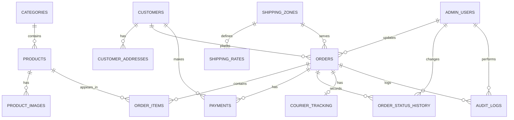

# UK Sweets Database Design

## 1. Overview

This document defines the relational database structure for the UK Sweets e-commerce application. The design is intended to support storefront browsing, order placement, payment handling, shipping, and administrative management while remaining extensible for future growth.

The design assumes a PostgreSQL relational database with strong constraints, clear relationships, and indexing suitable for production usage.

---

## 2. Core Design Principles

- Each table should represent a single business concept.
- Relationships should be explicit and enforceable with foreign keys.
- Critical business data such as payments, order state, and admin actions should be auditable.
- The schema should support both customer-facing operations and internal admin workflows.
- The system should be ready for future features like discounts, subscriptions, returns, and saved addresses.

---

## 3. Entity Overview

The database will include the following core entities:

- Customers
- Customer addresses
- Admin users
- Products
- Product images
- Categories
- Orders
- Order items
- Payments
- Shipping zones
- Shipping rates
- Order status history
- Courier tracking
- Audit logs

---

## 4. ER Diagram

---

## 5. Table Definitions

## 5.1 Customers

### Why it exists
Stores customer account information for storefront users, authentication, and order history.

### Primary Key
- `id` (UUID or bigserial)

### Foreign Keys
- None directly

### Relationships
- One customer can have many customer addresses.
- One customer can place many orders.
- One customer can have many payment attempts.

### Recommended indexes
- `email` unique index
- `created_at` index

### Constraints
- `email` must be unique and not null
- `first_name` and `last_name` should be not null
- `is_active` should default to true
- `created_at` should default to current timestamp

### Notes
Customer data should remain separate from payment processor details.

---

## 5.2 Customer Addresses

### Why it exists
Stores customer-delivered shipping and billing addresses so users can reuse saved addresses and orders can retain immutable address snapshots.

### Primary Key
- `id` (UUID or bigserial)

### Foreign Keys
- `customer_id` references `customers.id`

### Relationships
- One customer can have many saved addresses.
- An order can reference a saved address as the source of the shipping destination, while also preserving a snapshot copy.

### Recommended indexes
- `customer_id` index
- `is_default` index

### Constraints
- `customer_id` should be not null
- `address_line_1` should be not null
- `city` should be not null
- `postcode` should be not null
- `country_code` should be not null
- `is_default` should default to false

### Notes
This table improves checkout usability and keeps address data organized. Orders should not rely on the live address table for historical accuracy; they should preserve a snapshot of the address at the time of purchase.

---

## 5.3 Admin Users

### Why it exists
Stores internal staff users who manage products, orders, and platform operations.

### Primary Key
- `id` (UUID or bigserial)

### Foreign Keys
- None directly

### Relationships
- One admin user can manage many orders and many products depending on the business rules.
- One admin user can create many audit logs.
- A super admin can manage other admin users through future role assignment logic.

### Recommended indexes
- `email` unique index
- `role` index

### Constraints
- `email` must be unique and not null
- `role` should be constrained to a small allowed set such as `admin` and `super_admin`
- `is_active` should default to true
- `password_hash` should be stored securely

### Notes
This table is separate from customers because admin users should not be treated as storefront customers.

---

## 5.4 Categories

### Why it exists
Organizes products into logical groupings such as chocolates, gummies, gift boxes, or seasonal sweets.

### Primary Key
- `id` (UUID or bigserial)

### Foreign Keys
- `parent_category_id` references `categories.id` for nested categories if needed

### Relationships
- One category can contain many products.
- A category can have zero or many child categories.

### Recommended indexes
- `slug` unique index
- `parent_category_id` index
- `is_active` index

### Constraints
- `name` should be not null
- `slug` should be unique and not null
- `parent_category_id` should allow null for top-level categories
- `is_active` should default to true

### Notes
This table supports browsing and catalog organization.

---

## 5.5 Products

### Why it exists
Stores the product catalog available for purchase.

### Primary Key
- `id` (UUID or bigserial)

### Foreign Keys
- `category_id` references `categories.id`

### Relationships
- One category can have many products.
- One product can have many product images.
- One product can appear in many order items.

### Recommended indexes
- `category_id` index
- `slug` unique index
- `is_active` index
- `price` index if product filtering by price becomes necessary

### Constraints
- `name` should be not null
- `slug` should be unique and not null
- `price` should be non-negative
- `stock_quantity` should be non-negative
- `is_active` should default to true
- `is_featured` can default to false

### Notes
Stock management can be simplified initially and later expanded into a more advanced inventory model. Storing `stock_quantity` directly on the `Products` table is acceptable for the MVP. In future versions, inventory should be separated into dedicated tables such as `Inventory` and `Inventory Transactions` so that stock movement, replenishment, and adjustments are tracked independently from product information. Keeping inventory management separate from product information is beneficial because it improves auditing, supports more complex stock workflows, and makes it easier to manage reservations, restocks, and losses without affecting the core product catalog.

---

## 5.6 Product Images

### Why it exists
Supports multiple images per product so the storefront can show a gallery or featured visuals.

### Primary Key
- `id` (UUID or bigserial)

### Foreign Keys
- `product_id` references `products.id`

### Relationships
- One product can have many product images.

### Recommended indexes
- `product_id` index
- `is_primary` index
- `sort_order` index

### Constraints
- `product_id` should be not null
- `image_url` should be not null
- `is_primary` should default to false
- `sort_order` should default to 0

### Notes
This table allows a rich product experience without overloading the core product record.

### Future enhancement: Product Variants
The schema can later support product variants such as 250g, 500g, and 1kg pack sizes, different pack formats, and limited edition products. Variants are intentionally excluded from the MVP to keep the design simple.

---

## 5.7 Orders

### Why it exists
Represents a completed or in-progress purchase made by a customer.

### Primary Key
- `id` (UUID or bigserial)

### Foreign Keys
- `customer_id` references `customers.id`
- `shipping_zone_id` references `shipping_zones.id`
- `shipping_address_id` references `customer_addresses.id` optionally, for the saved address used at checkout
- `created_by_admin_id` references `admin_users.id` optionally, for admin-assisted orders

### Relationships
- One customer can place many orders.
- One order can contain many order items.
- One order can have many payment attempts.
- One order can have many status history records.
- One order can have one courier tracking record.
- One order can have many audit log entries.

### Recommended indexes
- `customer_id` index
- `status` index
- `created_at` index
- `shipping_zone_id` index

### Constraints
- `status` should be constrained to allowed values such as `pending`, `paid`, `processing`, `shipped`, `delivered`, `cancelled`, `refunded`
- `subtotal` should be non-negative
- `shipping_total` should be non-negative
- `tax_total` should be non-negative
- `discount_total` should be non-negative
- `grand_total` should be non-negative
- `currency` should be not null
- `created_at` should default to current timestamp

### Notes
The order table is the central record for the purchase lifecycle. It should also maintain a shipping address snapshot so the order remains accurate even if the customer later edits or deletes a saved address.

### Snapshot design
- `shipping_address_snapshot` should be stored as a JSONB field or equivalent structured payload containing the address values captured at checkout.
- This ensures an immutable record of the delivery destination for historical and support purposes.

---

## 5.8 Order Items

### Why it exists
Stores each product line inside an order.

### Primary Key
- `id` (UUID or bigserial)

### Foreign Keys
- `order_id` references `orders.id`
- `product_id` references `products.id`

### Relationships
- One order has many order items.
- One product can appear in many order items across many orders.

### Recommended indexes
- `order_id` index
- `product_id` index

### Constraints
- `quantity` must be positive
- `unit_price` should be non-negative
- `line_total` should be non-negative
- `product_name` should be not null
- `product_sku` may be nullable
- `product_id` and `order_id` should not be null

### Notes
Order items should preserve key purchase details at the moment of checkout so the order history remains accurate even if product data changes later.

### Snapshot fields to preserve
- `product_name`
- `product_sku`
- `product_slug`
- `unit_price`
- `discount_amount`
- `tax_amount`
- `line_total`
- `currency`
- `product_variant` if relevant

---

## 5.9 Payments

### Why it exists
Records payment attempts and payment success or failure details from Stripe or other providers.

### Primary Key
- `id` (UUID or bigserial)

### Foreign Keys
- `order_id` references `orders.id`
- `customer_id` references `customers.id`
- `created_by_admin_id` references `admin_users.id` optionally

### Relationships
- One order can have many payment attempts.
- One customer can have many payments.

### Recommended indexes
- `order_id` index
- `customer_id` index
- `provider_payment_id` unique index if available
- `status` index
- `attempt_number` index

### Constraints
- `amount` should be non-negative
- `currency` should be not null
- `status` should be constrained to values such as `pending`, `succeeded`, `failed`, `refunded`, `requires_action`
- `provider` should be not null
- `attempt_number` should be positive

### Notes
This table should store one row per payment attempt. That allows retries, failed charges, and multiple provider interactions without losing the order history.

---

## 5.10 Shipping Zones

### Why it exists
Represents geographic delivery areas for shipping cost calculation.

### Primary Key
- `id` (UUID or bigserial)

### Foreign Keys
- None directly

### Relationships
- One shipping zone can have many shipping rates.
- One order can belong to one shipping zone.

### Recommended indexes
- `code` unique index
- `name` index

### Constraints
- `name` should be not null
- `code` should be unique and not null
- `is_active` should default to true

### Notes
This supports region-based shipping costs and future expansion to international delivery.

---

## 5.11 Shipping Rates

### Why it exists
Defines the cost and rules for shipping to a given zone.

### Primary Key
- `id` (UUID or bigserial)

### Foreign Keys
- `shipping_zone_id` references `shipping_zones.id`

### Relationships
- One shipping zone can have many shipping rates.
- One order uses one shipping rate at the time of purchase.

### Recommended indexes
- `shipping_zone_id` index
- `is_active` index

### Constraints
- `price` should be non-negative
- `min_order_value` and `max_order_value` should be non-negative if used
- `is_active` should default to true

### Notes
Shipping rates can later support free shipping thresholds or weight-based pricing. Future enhancements can include fields such as weight, length, width, height, delivery speed, free shipping threshold, and courier-specific pricing rules. These are future enhancements and are not required for the MVP.

---

## 5.12 Order Status History

### Why it exists
Tracks every state transition of an order for auditability and customer communication.

### Primary Key
- `id` (UUID or bigserial)

### Foreign Keys
- `order_id` references `orders.id`
- `changed_by_admin_id` references `admin_users.id` when an admin changes the status

### Relationships
- One order can have many status history records.
- One admin can change many order statuses.

### Recommended indexes
- `order_id` index
- `created_at` index

### Constraints
- `status` should be constrained to the same allowed values as orders
- `note` may be nullable
- `created_at` should default to current timestamp

### Notes
This is essential for troubleshooting, customer support, and auditability.

---

## 5.13 Courier Tracking

### Why it exists
Stores shipment tracking information for fulfillment and customer updates.

### Primary Key
- `id` (UUID or bigserial)

### Foreign Keys
- `order_id` references `orders.id`

### Relationships
- One order can have one tracking record in the initial design.
- A tracking record can later be extended to multiple shipment attempts.

### Recommended indexes
- `order_id` unique index
- `tracking_number` unique index if available
- `status` index

### Constraints
- `tracking_number` should be unique if provided
- `carrier_name` should be not null
- `status` should be constrained to values such as `pending`, `in_transit`, `delivered`, `failed`

### Notes
This table helps keep shipping details separate from the core order lifecycle while still being easy to query.

---

## 5.14 Audit Logs

### Why it exists
Records significant administrative actions for security, support, and operational auditing.

### Primary Key
- `id` (UUID or bigserial)

### Foreign Keys
- `admin_user_id` references `admin_users.id`
- `order_id` references `orders.id` optionally

### Relationships
- One admin user can create many audit logs.
- One order can have many audit log entries.

### Recommended indexes
- `admin_user_id` index
- `order_id` index
- `created_at` index

### Constraints
- `action` should be not null
- `entity_type` should be not null
- `created_at` should default to current timestamp

### Notes
This table is intended for administrative actions only. The recommended production-style structure is to store the following fields: `admin_user_id`, `order_id`, `entity_type`, `entity_id`, `action`, `old_value`, `new_value`, and `created_at`. Customer activities such as login, logout, password reset, and profile changes should be stored in a separate `Customer Activity Log` in the future rather than in the `Audit Logs` table. This supports internal accountability and is valuable for debugging administrative changes.

---

## 6. Relationship Summary

### One-to-many
- Customer → Customer Addresses
- Customer → Orders
- Customer → Payments
- Category → Products
- Product → Product Images
- Order → Order Items
- Order → Payments
- Order → Order Status History
- Order → Courier Tracking
- Order → Audit Logs
- Shipping Zone → Shipping Rates
- Admin User → Order Status History
- Admin User → Audit Logs

### One-to-one or optional one-to-one
- Order → Courier Tracking (initial design)
- Order → Shipping address snapshot stored on the order itself

### Many-to-many
- No explicit many-to-many relationships are required in the initial design.

---

## 7. Suggested Constraints and Data Types

### Common recommendations
- Use `UUID` for primary keys for distributed-friendly identity and easier future scaling.
- Use `TIMESTAMPTZ` for timestamps to preserve timezone awareness.
- Use `NUMERIC(10,2)` for monetary values to avoid floating-point issues.
- Use `VARCHAR` with length limits for codes, slugs, emails, and short identifiers.
- Use `TEXT` for long descriptions or notes.
- Use `JSONB` for address snapshots and flexible metadata.

### Recommended enums
If the application uses PostgreSQL enums, they can be used for values such as:
- order status
- payment status
- tracking status
- user role

---

## 8. Indexing Strategy

The initial indexing plan should prioritize:
- Primary key lookup performance
- Customer and order lookups by foreign keys
- Search and filtering on product names, slugs, and active status
- Status-based order dashboards for admins
- Tracking lookups by tracking number
- Audit log retrieval by entity and timestamp

---

## 9. Design Notes for Future Growth

This schema is intentionally simple but extensible. Future enhancements could include:
- Discounts and coupon codes
- Returns and refunds
- Inventory reservations
- Wishlist and favorites
- Multi-warehouse fulfillment
- Customer addresses and saved shipping profiles
- Tax rules by region
- Subscription boxes or recurring purchases

---

## 10. Summary

This database design provides a clear and production-friendly structure for a UK sweets e-commerce system. It separates customer data, inventory, orders, payments, shipping, and admin actions into logical entities and uses explicit relationships and constraints to maintain data integrity while supporting richer order history, address snapshots, multi-image catalogs, and auditability.
